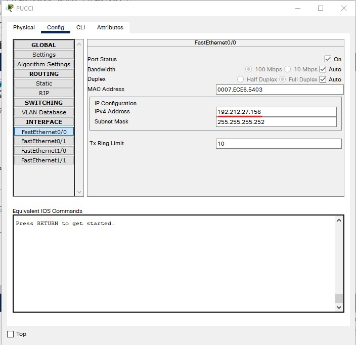

# Lapres Modul 4 Jarkom 2021 - T02
Laporan Hasil Praktikum Modul 4 Jarkom 2021
Kelompok T02
  * Herwinda Marwaa Salsabila (05311940000009)
  * Dian Arofati N. Z. (05311940000011)
  * Dava Aditya Jauhar (05311940000030)

---

## Persiapan

   **Soal**
    
   Pertama-tama buatlah pembagian subnet terhadap topologi soal. Berikut merupakan gambar topologi yang telah dibagi subnet:
   

Hasil pembagian subnet yang kami dapat adalah **15 Subnet**. Dengan Subnet A1 kami ambil dari yang paling jauh dari Foosha.

   **Jawaban**

## VLSM
   
   **Perhitungan dan pembagian IP**
   
Tentukan jumlah IP address yang dibutuhkan per subnet dari total subnet yang sebelumnya telah ditentukan, yaitu 15 subnet.
   
| Subnet | Jumlah IP | Netmask |
| --- | --- | --- |
| A1 | 721 | /22 |
| A2 | 252 | /24 |
| A3 | 2 | /30 |
| A4 | 521 | /22 |
| A5 | 13 | /28 |
| A6 | 502 | /23 |
| A7 | 2 | /30 |
| A8 | 2 | /30 |
| A9 | 1001 | /22 |
| A10 | 701 | /22 |
| A11 | 2 | /30 |
| A12 | 2021 | /21 |
| A13 | 101 | /25 |
| A14 | 2 | /30 |
| A15 | 2 | /30 |
| Total | 5845 | /19 |

Total jumlah IP addres didapatkan adalah 5845, sehingga masuk ke dalam netmask /19. Setelah itu, kami bentuk subnet paling besar dengan NID 192.212.0.0 dan netmask /19. Lalu, lakukan pembagian IP dengan bantuan IP tree seperti gambar berikut:
   
   
   
Dapatkan perhitungan broadcast dari IP tree (Network ID dan Netmask). Pada contoh ini, kami tunjukan perhitungan Broadcast Addr seperti pada gambar menggunakan NID A1 yaitu 192.212.26.0 dan Netmask /24:
  
   

Berikut merupakan tabel rangkuman untuk sebuah subnet yang memiliki NID, Netmask, dan Broadcast Address yang berhasil kami dapatkan:

   
   
Setting IP pada tiap interface yang ada di setiap device sesuai dengan pembagian subnet pada pohon VLSM. Sebagi berikut:
   
   1. Pada Foosha
  
  - Konfigurasi Foosha
  
  
   2. Pada Blueno
   
        
   
   3. Pada Water7
   
   - Konfigurasi Water7 Static
   
     
     
   - Konfigurasi Water7 Interface
   
   
   
   
   
   

   
   4. Pada Chiper
    
        
   
   5. Pada Pucci
   
   -Konfigurasi Pucci Static
   
   

   -Konfigurasi Pucci Interface
   
   
   
    
   
   
   
   6. Pada Calmbelt
   
        
   
   7. Pada Courtyard
   
        
   
   8. Pada Jipangu
   
 
   
   9. Pada Doriki
   
        
   
   10. Pada Guanhao
   
   -  Konfigurasi Guanhao Static
   
       

       

   
   -  Konfigurasi Guanhao Interface
   
        
        
        
        
        
        
        
   
   11. Pada Jabra
   
        
   
   12. Pada Maingate
   
        
   
   13. Pada Alabasta
   
   - Konfigurasi Alabasta Static
        
        
   
   - Konfigurasi Alabasta Interface
        
        
        
        
        
   14. Pada Jorge
   
        
   
   15. Pada Oimo
   
   
   
   16. Pada Fukurou
   
        
   
   17. Pada EniesLobby
   
        
   
   18. Pada Seastone
   
        
       
        

        

   
   19. Pada Elena
   
   

        
       
---
## CIDR

Pertama, buat satu node yang terhubung dengan internet dengan nama NAT1 dan sambungkan dengan router foosha melalui interface `nat0` menuju interface `eth0`.
Selanjutnya, tempatkan node-node yang lain seperti pada soal.

Tentukan subnet yang ada dalam topologi dan melakukan labelling netmask terhadap masing-masing subnet. Gabungkan subnet paling bawah di dalam topologi. Paling bawah berarti subnet yang paling jauh dari internet.
Penggabungan dan pengelompokkan subnet dapat dilihat pada gambar berikut:

   
      
   

   
   
Subnet C akan digabungkan menjadi 2 subnet yang lebih besar yang dinamakan **D1** dan **D2**. **D1** dan **D2** menjadi **E1**   

   

   **Perhitungan dan pembagian IP**
   List subnet-nestmask ada setelah penggabungan ini didapatkan dengan menggunakan teknik CIDR subnet gabungan yang akan memiliki netmask yang 1 tingkat di atas subnet terbesar yang digabungkan
   
| Subnet | Jumlah IP | Netmask |
| --- | --- | --- |
| A1 | 721 | /22 |
| A2 | 252 | /24 |
| A3 | 2 | /30 |
| A4 | 521 | /22 |
| A5 | 13 | /28 |
| A6 | 502 | /23 |
| A7 | 2 | /30 |
| A8 | 2 | /30 |
| A9 | 1001 | /22 |
| A10 | 701 | /22 |
| A11 | 2 | /30 |
| A12 | 2021 | /21 |
| A13 | 101 | /25 |
| A14 | 2 | /30 |
| A15 | 2 | /30 |
| Total | 5845 | /19 |

   Tabel penggabungan subnet

| Subnet | Asal Subnet | Netmask |
| --- | --- | --- |
| B1 | A1 + A2 | /21 |
| B2 | A3 + A14 | /29 |
| B3 | A7 + A4 | /21 |
| B4 | A6 + A5 | /22 |
| B5 | A12 + A13 | /20 |
| B6 | A10 + A11 | /21 |
| B7 | A8 + A9 | /21 |
| C1 | B1 + B2 | /20 |
| C2 | B3 + B4 | /20 |
| C3 | B5 + B6 | /19 |
| C4 | B7 + A15 | /20 |
| D1 | C1 + C2 | /19 |
| D2 | C3 + C4 | /18 |
| E1 | D1 + D2 | /17 |
   
   Tabel pembagian IP
   
   Buat Tree CIDR dengan cara penggabungan Subnet seperti pada gambar Topologi yang telah dikelompokkan dan ip addres netmask dari masing-masing subnet:
   
   

   Berikut merupakan tabel hasil perhitungan Broadcast Address dari setiap subnet A1-A15:
   
   
  
 Selanjutnya, lakukan konfigurasi terlebih dahulu disetiap router, server, dan PC:
   
   **Pengaturan pada tiap node**
   
   Pada Foosha

  **Konfigurasi**

  **Routing**
  

  **Uji Coba**
  
   
  
   - Uji coba ping `Foosha` ke `chiper`
   
   

   - Uji coba ping `Foosha` ke `Elena`
   
   
   
   - Uji coba ping `Foosha` ke `Jipangu`
   
   
   
   - Uji coba ping `Foosha` ke `Jorge`
   
   
        
   - Uji coba ping `Foosha` ke `Oimo`
   
   
        
   - Uji coba ping `Foosha` ke `Google`
   
   

   
   
 Pada Water7
   
   **Konfigurasi**
   
   

   

  **Routing**
  
   
  
  
  Pada Pucci
   
  **Konfigurasi**
  
  

  

   
  Pada Guanhao
  
  **Routing**
  
  

 **Konfigurasi**
 
  
  
  

   
  Pada Alabasta
   
 

  Pada Oimo
  
  **Configurasi**
  
  
  

  **Routing**
  
  
   
   Pada Seastone
   
      
   
   Pada Elena
   
   - Uji coba ping `Elena` ke `Doriki`
   
   

   - Uji coba ping `Elena` ke `Fukurou`
   
   
   
   - Uji coba ping `Elena` ke `Jipangu`
   
   
        
   - Uji coba ping `Elena` ke `Jorge`
   
   
        
   - Uji coba ping `Elena` ke `Google`
   
   
  
  Pada Jipangu
       
   - Uji coba ping `jipangu` ke `Jorge`
   
   
   
   - Uji coba ping `jipangu` ke `Google`
   
   
  
 
 Pada Oimo
 
   **Routing**
      
   

   **Konfigurasi**
   
   

   

   **Uji Coba**
      
   - Uji coba ping `Oimo` ke `Chiper`

     
        
   - Uji coba ping `Oimo` ke `Pucci`

   

---

## Kendala

1. Awalnya kesulitan saat menggabungkan tiap subnet pada metode CIDR dan sempat menyentuh subnet /15 yang mana harus menambah oktet ke-2.
2. Ada ketidakjelasan informasi pada soal sehingga cukup kebingungan saat mengerjakan.
3. Salah satu anggota kelompok kebetulan ada keperluan mendesak (lomba) yang menyebabkan ketidaklengkapan anggota kelompok yang mengerjakan.
4. Saat dijalankan ada beberapa konfigurasi yang kurang tepat sehingga tidak sesuai harapan.
